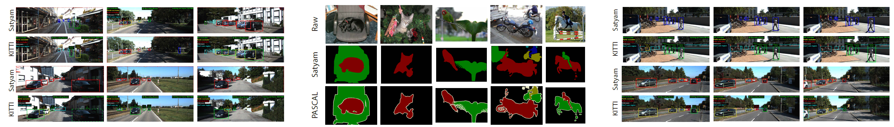
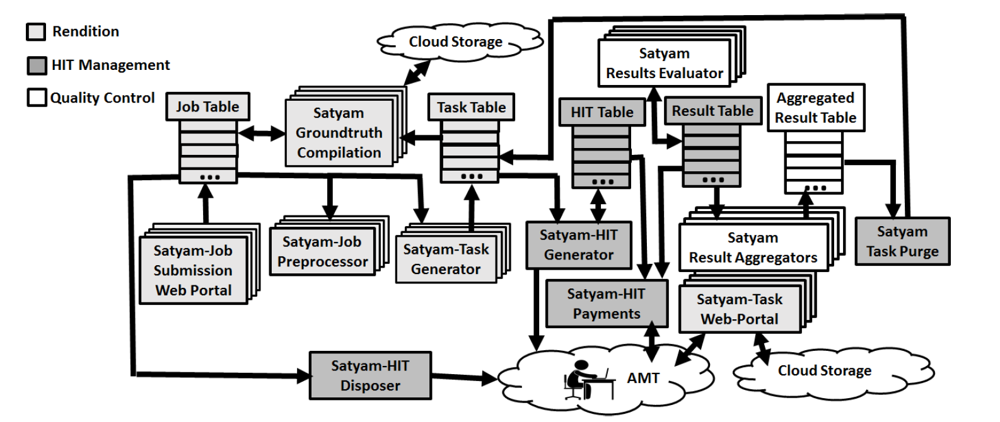
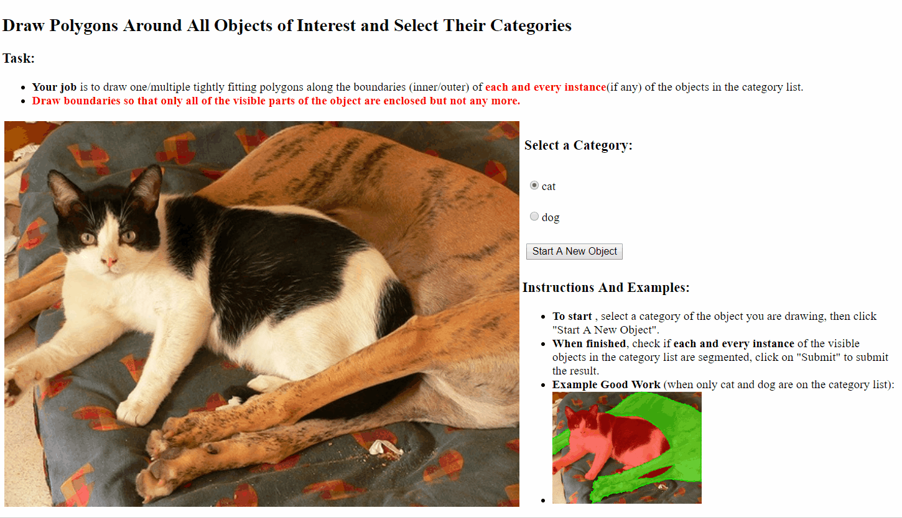
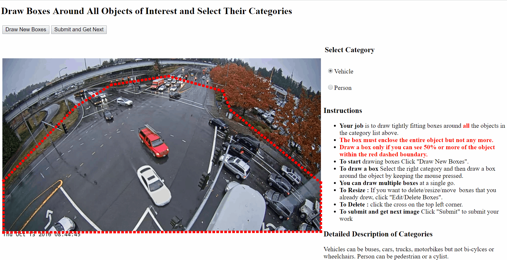

# Automated Groundtruth Collection for Machine Vision

[](https://travis-ci.org/carla-simulator/carla)
[](http://carla.readthedocs.io)
[](http://badges.mit-license.org) 

Satyam is an open-source automated groundtruth collection system for machine vision tasks, such as classification, detection, tracking, segmentation, etc. The system enables researchers to collect high-quality labels at scale and build custom datasets for novel applications with minimal effort, latency and cost. 

**DISCLAIMER**: This is an alpha anonymous release meant for reviewers and may not be very user-friendly at this point. A broader open-source release will have better support for easily configuring the system.



## How Satyam Works



## Getting Started

> Prerequisites

- Amazon mechanical turk [requester account](https://requester.mturk.com/)
- Visual studio ([latest](https://visualstudio.microsoft.com/))
- Azure [account](https://azure.microsoft.com/) (local storage comming soon)

> Provisioning Task Pages

Currently, Satyam supports the following machine vision tasks. In order to collect annotations, host these task pages (in SatyamTaskPages folder) on **<YOUR_TASKPAGE_SERVER_ADDRESS>**. The host address can be "localhost" for a small scale local test, but needs to be public when using AMT.

- Segmentation Task Page ([Demo](http://satyamresearchtaskpages.azurewebsites.net/ImageSegmentation_Demo.aspx))


- Tracking Task Page ([Demo](http://satyamresearchtaskpages.azurewebsites.net/MultiObjectTrackingDemo.aspx))


- Detection Task Page ([Demo](http://satyamresearchtaskpages.azurewebsites.net/MultiObjectLocalizationAndLabelingDemo.aspx))


- Image Classification Task Page ([Demo](http://satyamresearchtaskpages.azurewebsites.net/SingleObjectLabelingDemoPage.aspx)) 
- Video Classification Task Page ([Demo](http://satyamresearchtaskpages.azurewebsites.net/SingleObjectLabelingInVideoDemo.aspx))
- Counting in Image Task Page ([Demo](http://satyamresearchtaskpages.azurewebsites.net/ObjectCountingInImageDemo.aspx))
- Counting in Video Task Page ([Demo](http://satyamresearchtaskpages.azurewebsites.net/ObjectCountingInVideoDemoPage.aspx))

> Provisioning Database

Satyam uses a cloud database to record (intermediate) results and trigger Azure Functions for automated monitoring and execution. Create the tables (in the SQLTables folder) under your Azure storage account. To create all the tables in one shot, run config_database() (coming soon). To manually create a specific table, you can use [SQL Server Manager Studio (SSMS)](https://docs.microsoft.com/en-us/sql/ssms/sql-server-management-studio-ssms)

> Preparing Data

Satyam accepts the following format for each task:
- Classification, Counting: image, video
- Detection: image
- Tracking: video, folders of frames
- Segmentation: image
The data should be placed in a container (<YOUR_DATA_CONTAINER>) in your Azure storage account. 

> Configuration

Fill in the configuration constants in Constants/ConfigConstants.cs as follows:
```csharp
  AZURE_STORAGE_CONNECTION_STRING = "DefaultEndpointsProtocol=https;AccountName=<YOUR_AZURE_BLOB_NAME>;AccountKey=<YOUR_AZURE_ACCOUNT_KEY>;EndpointSuffix=core.windows.net";
  AZURE_SQL_DATABASE_CONNECTION_STRING = "<YOUR_AZURE_SQL_DATABASE_CONNECTION_STRING>"
  AZURE_BLOB_URL = "https://<YOUR_AZURE_BLOB_NAME>.blob.core.windows.net/";
  TASKPAGE_SERVER_ADDRESS = "<YOUR_TASKPAGE_SERVER_ADDRESS>";
  MODEL_SERVER_ADDRESS = "<YOUR_TENSORFLOW_SERVING_ADDRESS>"; //(OPTIONAL)
```

## Launching Tasks Locally

Satyam provides a portal webpage for easily configuring local launches.
- Open LandingPage.aspx in SatyamPortal. 
- Click on "Launching New Job". 
- Select the task from the drop-down list.
- Fill in the Azure Blob Connection String, and the Container Name and the Directory Name (Optional) of your data. 
- Input task-specific parameters, e.g. object categories.
- Click on "Submit Job". 
- Run PeriodicManagement.RunLoop()
- Now load the correct task pages, which should populate your data ready to be labeled.
- Whenever Satyam collects enough label for each sample, an aggregated result will be generated.
- When all tasks done, check SatyamAnalysis project for task-specific visualization.

## Launching Tasks using AMT
- Open LandingPage.aspx in SatyamPortal. 
- Click on "Launching New Job". 
- Select the task from the drop-down list.
- Fill in the Azure Blob Connection String, and the Container Name and the Directory Name (Optional) of your data. 
- Input task-specific parameters, e.g. object categories.
- Check "Using Amazon Mechanical Turk".
- Input your AMT requester account Access Key ID and Secret Access Key ID.
- Specify the reward for each complete annotation.
- Submit the job.
- Run PeriodicManagement.RunLoop()
- Check if tasks are successfully launched on AMT (alternatively, use Sandbox before launching to AMT)
- When all tasks done, check SatyamAnalysis project for task-specific visualization.

## Tutorials
- [Building a Detection Dataset](https://github.com/CoolDunes/AutoGT/blob/master/Docs/Building%20A%20Detection%20Dataset)
- [Using a Tensorflow Serving Backend](https://github.com/CoolDunes/AutoGT/blob/master/Docs/Satyam%20on%20Azure%20Functions)
- [Offloading the management loop using Azure Functions](https://github.com/CoolDunes/AutoGT/blob/master/Docs/Using%20Tensorflow%20Serving%20as%20a%20Backend)


